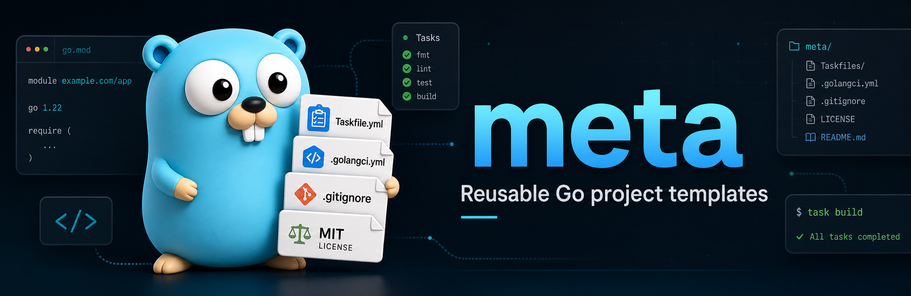

# meta

This repo contains Alex's meta configuration files:

- `.gitignore` template
- `.golangci.yml` configuration
- `LICENSE` template
- `Taskfile.yml` templates (see [Taskfiles](#taskfiles))

## Taskfiles

The `Taskfiles/` directory holds [Task](https://taskfile.dev) templates for each
kind of Go project. Tasks shared by every project type (`fmt`, `lint`, `vet`,
`deps:*`, `test:*`, coverage, cache/coverage cleanup) live once in
`Taskfiles/common.yml`. Each project-type template includes it with
`flatten: true`, so the shared tasks appear unprefixed (`task lint`, `task test`)
alongside the type-specific ones.

```text
Taskfiles/
├── common.yml             # shared tasks (don't use directly)
├── cli/Taskfile.yml       # + build / cross-compile / dev:install
├── library/Taskfile.yml   # + compile-check build, optional Taskfile.project.yml
└── lambda/Taskfile.yml    # + build / package / deploy (AWS)
```

| Template | Adds on top of the shared tasks |
| --- | --- |
| `cli` | `build`, `build:check`, `clean`, `dev:install`, `install`, `dev:clean`; version/commit/date build stamping via `internal/appmeta` |
| `library` | `build` (compile-check, no binary), `check` incl. `vet`; optional repo-local `Taskfile.project.yml` under the `project:` namespace |
| `lambda` | `build`, `package`, `package:clean`, `deploy` (zips `bootstrap`, ships via `aws lambda update-function-code`) |

### Using a template in a project

Copy both the shared file and the matching template into the target repo, then
rename the template to `Taskfile.yml`:

```sh
# from the target repo root
cp /path/to/meta/Taskfiles/common.yml           ./taskfiles/common.yml
cp /path/to/meta/Taskfiles/library/Taskfile.yml ./Taskfile.yml
```

> [!WARNING]
> The template includes the shared file as `../common.yml`. If you place `common.yml`
> in a different location, e.g. `./taskfiles/common.yml` (as shown above),
> update that include to `./taskfiles/common.yml`.
> If you place the `common.yml` next to the `Taskfile.yml`, update that include to
> `./common.yml`. Then fill in the placeholder `vars` (`OWNER`, `REPO`,
> `APP_NAME`, etc.) and run `task` to list the available tasks.

> [!NOTE]
> A future iteration may load `common.yml` via a remote (URL) include so
> projects always track the latest shared tasks without copying.

## Credit

This repo is inspired by [@charmbracelet](https://github.com/charmbracelet)'s [meta](https://github.com/charmbracelet/meta) repository.

Thanks to [@charmbracelet](https://github.com/charmbracelet) for all the awesome stuff they create in Go!

## License

This project is licensed under the MIT License - see the [LICENSE](LICENSE) file for details.
