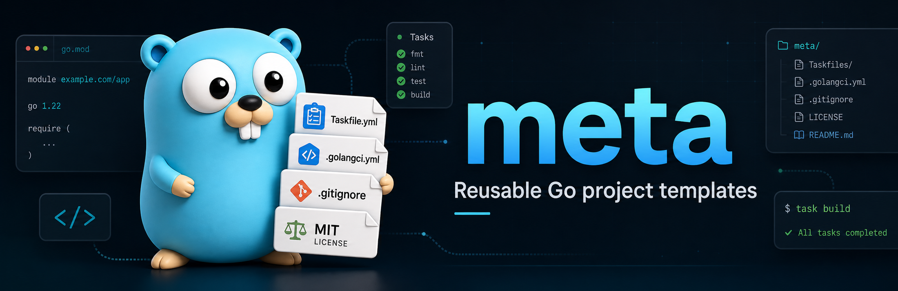

# meta

This repo contains Alex's meta configuration files:

- `.gitignore` template
- `.golangci.yml` configuration
- `LICENSE` template
- `Taskfile.yml` templates (see [Taskfiles](#taskfiles))
- `appmeta` build metadata package (see [appmeta](#appmeta))
- `meta-check` skill for drift checks (see [Drift check](#drift-check))

## Taskfiles

The `taskfiles/` directory holds [Task](https://taskfile.dev) templates for each
kind of Go project. Tasks shared by every project type (`fmt`, `lint`, `vet`,
`vuln`, `deps:*`, `test:*`, coverage, cache/coverage cleanup) live once in
`taskfiles/common.yml`. Each project-type template includes it with
`flatten: true`, so the shared tasks appear unprefixed (`task lint`, `task test`)
alongside the type-specific ones.

```text
taskfiles/
├── common.yml             # shared tasks (don't use directly)
├── cli/Taskfile.yml       # + build / cross-compile / dev:install
├── library/Taskfile.yml   # + compile-check build
└── lambda/Taskfile.yml    # + build / package / deploy (AWS)
```

All three templates also pick up an optional, repo-local
`taskfiles/Taskfile.project.yml` under the `project:` namespace — see
[Repo-specific tasks](#repo-specific-tasks).

| Template | Adds on top of the shared tasks |
| --- | --- |
| `cli` | `build`, `build:check`, `clean`, `dev:install`, `install`, `dev:clean`; name/version/commit/date build stamping via `internal/appmeta` |
| `library` | `build` (compile-check, no binary), `check` incl. `vet` |
| `lambda` | `build`, `package`, `package:clean`, `deploy` (zips `bootstrap`, ships via `aws lambda update-function-code`) |

### Using a template in a project

Copy both the shared file and the matching template into the target repo, then
rename the template to `Taskfile.yml`:

```sh
# from the target repo root
mkdir -p taskfiles
cp /path/to/meta/taskfiles/common.yml           ./taskfiles/common.yml
cp /path/to/meta/taskfiles/library/Taskfile.yml ./Taskfile.yml
```

That layout needs no edit: the templates already include the shared file as
`./taskfiles/common.yml`, relative to the destination repo root. Fill in the
placeholder `vars` (`OWNER`, `REPO`, `APP_NAME`, etc.) and run `task` to list the
available tasks.

> [!WARNING]
> Keep `common.yml` at `taskfiles/common.yml`. If you put it somewhere else — next
> to the `Taskfile.yml`, say — update the include to match (`./common.yml`), and
> keep the path repo-relative. A path that leaves the repo can still resolve
> against a stray copy in the parent directory, so `task` appears to work for you
> while failing for everyone else: in a fresh clone the include fails at parse time
> and every task dies, not just the shared ones.

> [!NOTE]
> The include deliberately does not resolve inside this repo — the templates are
> not meant to run in place. Pointing it at `../common.yml` would work here and
> break every consumer, which is the trade this way round avoids.

### Repo-specific tasks

Tasks that only make sense for one repo go in `taskfiles/Taskfile.project.yml`,
which every template includes under the `project:` namespace (`task project:<name>`).
The file is optional — a repo without one works unchanged.

```text
taskfiles/
├── common.yml              # vendored from this repo, don't edit
└── Taskfile.project.yml    # yours, optional
```

> [!WARNING]
> Keep it at exactly that path. Because the include is `optional: true`, a
> mismatch is **silent**: the tasks never appear, `task --list` looks normal, and
> `task project:<name>` exits 0 without running anything. Nothing tells you the
> file was ignored.

> [!NOTE]
> A future iteration may load `common.yml` via a remote (URL) include so
> projects always track the latest shared tasks without copying.

## appmeta

The `appmeta/` directory holds the build metadata package that the `cli` and
`lambda` Taskfiles stamp via `-ldflags`. Copy it into the target repo:

```sh
# from the target repo root
mkdir -p internal/appmeta
cp /path/to/meta/appmeta/*.go ./internal/appmeta/
```

`Name` is stamped from the Taskfile's `APP_NAME`. When nothing was stamped, it
falls back to the last element of the main package path (`cmd/<app>` gives
`<app>`), and `Version` falls back to the module version Go embeds
in the binary, so `go install module@vX.Y.Z` reports the tag instead of `dev`.
A build with `-buildvcs=false` still reports `dev`.

## Drift check

Copied files drift as this repo evolves. The `skills/meta-check` skill checks a
repo, or every repo in a folder, against the current templates and reports what
is behind, what is a deliberate local extension, and which repo-specific tasks
are worth reusing elsewhere. Make it available in every project by linking it
into your personal skills directory:

```sh
ln -s "$PWD/skills/meta-check" ~/.claude/skills/meta-check
```

Then ask Claude Code to "check this repo for meta drift" from any repo, or to
check a whole folder of repos. The comparison itself is a plain script you can
also run directly:

```sh
bash skills/meta-check/scripts/meta-check.sh [--type cli|library|lambda] [PATH]
bash skills/meta-check/scripts/meta-check.sh --dir ~/src
```

It compares against `main` on GitHub (`META_REF` selects another branch, tag or
full commit ID), so changes here only count once they are pushed. The ref is
resolved to its current commit first, so a push counts at once, not only after
GitHub's raw file cache expires. `LICENSE` is not checked:
licenses legitimately differ per repo. `internal/appmeta` is checked against
`appmeta/` for `cli` and `lambda` projects that have it.

## Credit

This repo is inspired by [@charmbracelet](https://github.com/charmbracelet)'s [meta](https://github.com/charmbracelet/meta) repository.

Thanks to [@charmbracelet](https://github.com/charmbracelet) for all the awesome stuff they create in Go!

## License

This project is licensed under the MIT License - see the [LICENSE](LICENSE) file for details.
